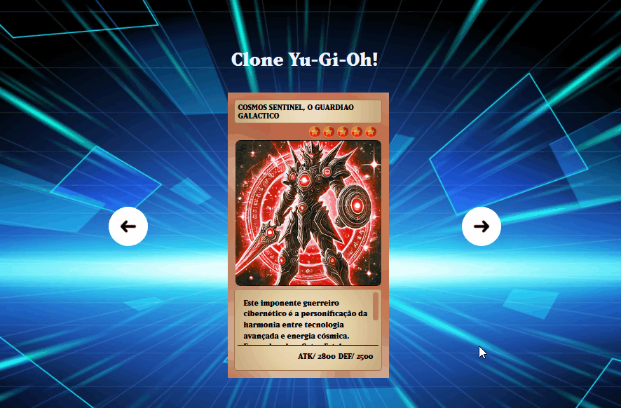

# Projeto DevQuest - Clone YU-GI-OH!
Esse projeto foi feito junto com os gêmeos do ```Dev em dobro``` no curso ```DevQuest``` 🧙🏻‍♂️🧙🏻‍♂️

Baseado nos cards do anime Yu-gi-oh!, criamos nossos próprios cards com novos monstros incíveis.

[](https://raffa-schnoeller.github.io/clone-yu-gi-oh/)

## Tecnologias utilizadas
- HTML
- CSS3
- JS

## Como utilizar

```
Clique na carta para mudar para o modo de defesa
```

```
Utilize as setas para alterar a carta
```

